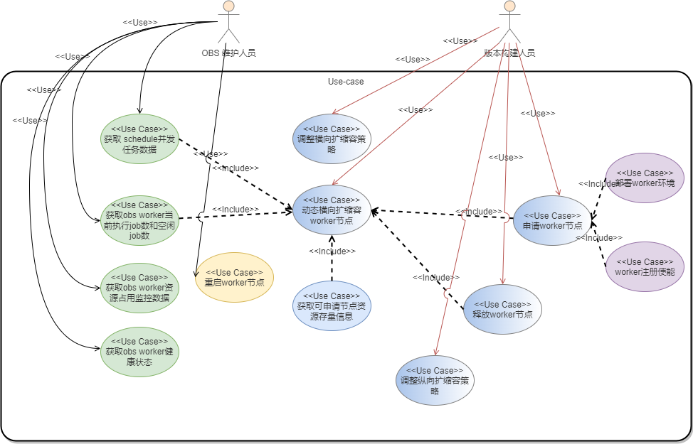
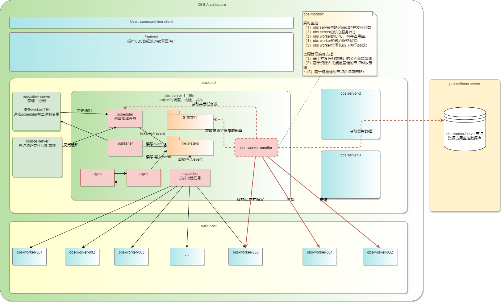
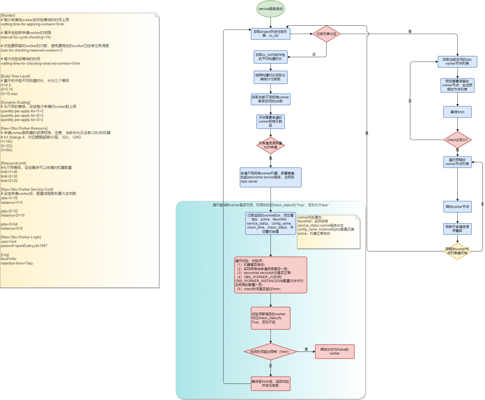
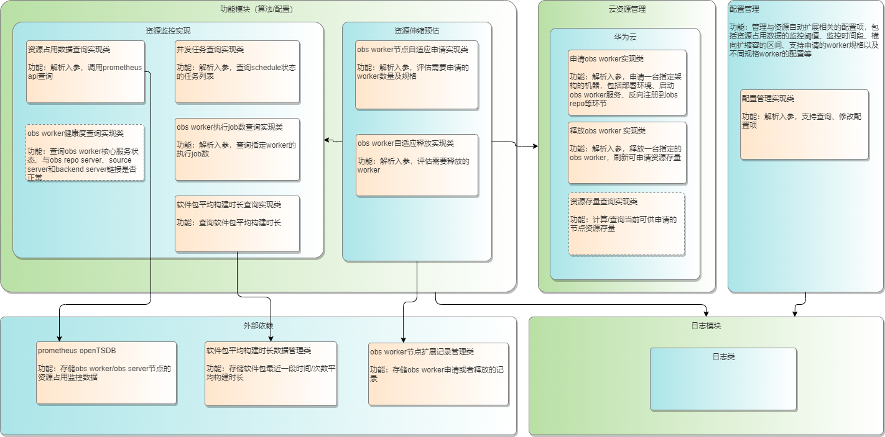
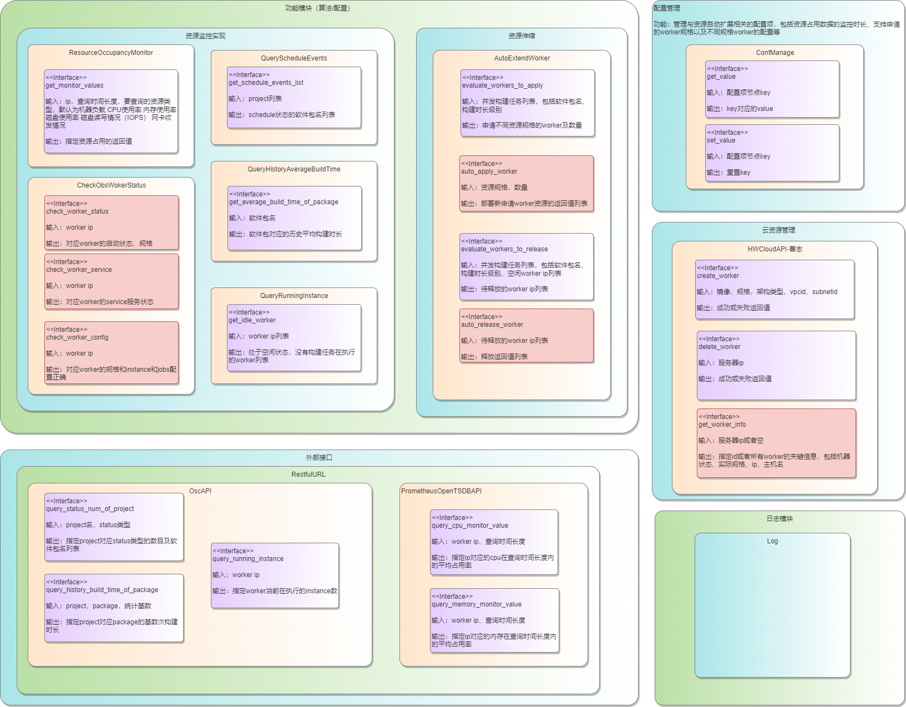
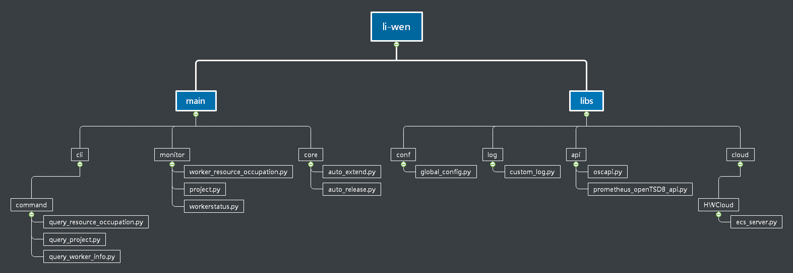

# 支持obs worker资源自动扩展方案设计

## 1.背景
围绕欧拉生态发展目标以及重点突破行业，构建领先的场景化竞争力，发挥openEuler全场景优势，典型的应用场景“等成本”条件下性能优先，打造极简开发、高效集成的欧拉生态工具链。

openEuler的构建系统基于suse开源的open-build-service搭建，其资源配置在初期满足一两个openEuler版本（public）工程和若干个开发者个人（private）工程日常构建绰绰有余，但是随着openEuler发行及维护版本越来越多，对于工程能力优化要求更加强烈。

当前openEuler每次完整构建版本平均需要12小时，对于每日版本构建、版本迭代测试都造成了一定的阻塞，也使得开发对单包的构建问题无法及时的自测和闭环。

我们针对openEuler的构建资源，做了调研，长期观察发现，
1. OBS的主调度服务器95节点负责openEuler所有public工程的调度，逐渐不能平衡处理多个版本工程并行构建的场景，特别是scheduler、dispatcher、singer等服务是单线程，存在任务block的情况；

2. OBS的worker节点arm和x86架构各有30台左右（其中各有3台给home工程构建使用），规格以32U和64U为主，资源使用和配置：

    （1）每次rebuild工程之后，一段时间内有700~1000个job等待分发，观察worker节点的instance占用率85%~90%

    （2）32C + 64GB + 超高 IO 三者配置，结合obs worker本身配置：OBS_WORKER_JOBS=32 OBS_WORKER_INSTANCES=7，资源使用率比较均衡

故，我们设计此obs worker资源自动扩展方案，支持自动管理obs worker资源的“忙时申请，闲时释放”，在openEuler版本工程并发构建时，最大化申请worker节点以缓解构建任务的并发程度，在版本工程构建结束或者不需要构建时，节省资源经费。

## 2. 需求描述
1. 自动管理obs worker资源的申请释放，通过配置文件来调整扩展的策略；
2. 获取obs worker节点的实时资源占用数据，辅助obs 维护人员和版本构建人员发现和定位问题

## 3.需求分析
### 3.1 受益人

|角色|角色描述|
|:--|:-------|
| 版本构建人员 | 负责每日和正式版本构建|
| OBS维护人员 | 负责OBS构建系统的正常运转，版本构建jenkins任务的正常执行 |

### 3.2 定义需求场景
#### 3.2.1 worker忙：
1. 1个或者多个工程的schedule任务数远大于空闲job数；
2. 特定包在schedule状态时，没有合适规格的worker空闲（比如kernel、gcc）；

#### 3.2.2 worker闲：
1. schedule任务数远小于空闲worker数；

### 3.3 用例视图

### 3.4 架构图

### 3.5 流程图

### 3.6 逻辑视图&类图

### 3.7 开发者视图

### 3.8 obs worker资源自适应伸缩策略
#### 3.8.1 前提：
1. 资源可扩展规格不限，上限为允许再申请128U*14=1792U
2. 新增两台obs server，分别调度版本工程：

(1) backend(95):

    openEuler:21.03
    openEuler:21.03:Epol
    openEuler:21.09
    openEuler:21.09:Epol

(2) backend_002（新增）:

    openEuler:Mainline
    openEuler:Epol
    openEuler:Factory
    openEuler:20.03:LTS:Next
    openEuler:20.03:LTS:Next:Epol

(3) backend_003（新增）:

    openEuler:20.03:LTS
    openEuler:20.03:LTS:SP1
    openEuler:20.03:LTS:SP1:Epol
    openEuler:20.03:LTS:SP2
    openEuler:20.03:LTS:SP2:Epol

#### 3.8.2 自适应申请worker节点策略

（1）定义软件包不同构建时长级别：
- l1：构建时长小于5min，建议申请16U/32Uworker；
- l2：构建时长小于10min，建议申请32U/64Uworker；
- l3：构建时长大于15min；建议申请64U/128Uworker；

（2）定义不同规格worker默认配置的job数：
- l1_def_jobs = 7;
- l2_def_jobs = 7;
- l3_def_jobs = 12或者1;
备注：部分包在更高核的机器上构建优化效果更明显，gcc、kernel

（3）定义对应l1~l3的当前project上等待构建任务数（schedule状态）：
- l1_sc_num;
- l2_sc_num;
- l3_sc_num;

（4）定义生产环境中不同规格的worker上空闲的job数：
- l1_wait_jobs;
- l2_wait_jobs;
- l3_wait_jobs;

—————————————————————————分割线————————————————————————————

定义对应不同规格worker的预申请数：
- new_l1_worker;
- new_l2_worker;
- new_l3_worker;

以new_l2_worker为例：
new_l2_worker = (l2_sc_num - l2_wait_jobs) / l2_def_jobs;

调用华为云CreateServers接口申请机器。

#### 3.8.3 自适应释放worker节点策略
每隔一段时间，检查所有worker节点instance忙闲状态，针对没有instance在执行的worker节点，预留一部分给待调度的构建任务，其余都调用华为云DeleteServers接口释放。

### 3.9 obs worker资源独占策略
基于多台obs server分布式调度openEuler版本工程的前提，当需要优先构建某个版本时，强制将所有worker设置为只给某台obs server调用，达到版本构建期间独占的效果

### 3.10 可靠性设计
#### 3.10.1 新申请worker可用状态检测
申请worker之后，检测机器是否打到可用状态，检测项包括：
（1）机器是否启动；
（2）实际规格与申请规格是否一致；
（3）obsworker.service状态是否正常；
（4）OBS_WORKER_JOBS和OBS_WORKER_INSTANCES与配置文件中对应规格的配置一致；
（5）check时间是否超过5min；

## 4. 特性清单
### SR-01：支持查询obs worker状态、硬件资源占用情况和instance调度情况 （待对齐）
补充：worker状态包括机器运行状态、obsworker.service状态、规格和配置一致性校验结果

责任人：孙国帅

相关人：刘奇

开发语言：shell/python

|no|AR描述|工作量预估|关联类|关联模块|责任人|
|:------|:----|:----|:----|:----|:----|
|1| 支持查询obs worker资源占用监控数据|1k|ResourceOccupancyMonitor|资源监控实现|孙国帅|
|2| 支持查询生产环境中obs worker ip列表|0.5k|ResourceOccupancyMonitor|资源监控实现|惠高鑫琰|
|3| 支持查询obs worker当前运行的instance数据|0.5k|OscAPI、QueryRunningInstance|资源监控实现、RestfulURL|孙国帅|
|4| 支持查询obs worker的obsworker.service状态|0.5k|CheckObsWokerStatus|资源监控实现|孙国帅|
|5| 支持查询obs worker当前机器运行状态|0.3k|CheckObsWokerStatus|资源监控实现|惠高鑫琰 |
|6| 支持查询obs worker实际规格和配置项是否与申请配置一致|0.5k|CheckObsWokerStatus|资源监控实现|惠高鑫琰 |
|7| 支持统计当前处于idle状态的instance，按照架构和不同规格分类|0.5k|OscAPI、QueryRunningInstance|资源监控实现、RestfulURL|王歌|
|8| 支持统计当前处于空闲状态的worker ip列表，按照架构分类|0.5k|OscAPI、QueryRunningInstance|资源监控实现、RestfulURL|王歌|

### SR-02：支持查询OBS project状态和软件包构建数据

责任人：王歌
|no|AR描述|工作量预估|关联类|关联模块|责任人|
|:------|:----|:----|:----|:----|:----|
|1| 支持查询OBS project不同状态软件名列表|0.25K|OscAPI|资源监控实现、RestfulURL|王歌|
|2| 支持查询OBS project软件包的历史构建时长数据|0.25K|OscAPI|资源监控实现、RestfulURL|王歌|
|3| 支持查询OBS project schedule状态不同架构不同构建时长级别的数量统计结果|0.25K|QueryHistoryAverageBuildTime、OscAPI|资源监控实现、RestfulURL|王歌|

### SR-03：支持动态扩展worker机器（待对齐）
责任人：姚凯
|no|AR描述|工作量预估|关联类|关联模块|责任人|
|:------|:----|:----|:----|:----|:----|
|1| 支持评估要申请不同规格的worker及数目|0.15k|evaluate_workers_to_apply||夏森林|
|2| 支持评估要释放的worker|0.2k|evaluate_workers_to_release||夏森林|
|3| *支持调用华为云接口申请worker服务器|0.1k|auto_apply_worker||夏森林|
|4| *支持调用华为云接口释放worker服务器|0.1k|auto_release_worker||夏森林|
|5| 华为云接口支持申请worker服务器|0.1k|HWCloudAPI||刘奇|
|6| 华为云接口支持释放worker服务器|0.1k|HWCloudAPI||刘奇|
|7| *华为云接口支持查询worker服务器关键信息，包括机器状态、实际规格、ip、主机名|0.1k|HWCloudAPI||刘奇|
|8| 支持修改worker上核心服务：obsworker.service的参数：OBS_WORKER_INSTANCES、OBS_WORKER_JOBS，并重启 ||||王歌|

### SR-04：支持通过配置项管理worker动态扩展策略
责任人：王歌
|no|AR描述|工作量预估|关联类|关联模块|责任人|
|:------|:----|:----|:----|:----|:----|
|1| 支持配置项查询|0.1K||||

### SR-05：支持本特性功能通过service管理
责任人：李海炜
|no|AR描述|工作量预估|关联类|关联模块|责任人|
|:------|:----|:----|:----|:----|:----|
|1| 支持systemctl管理 |0.05k||||
|2| ******||

## 5、接口清单

### 5.1、obs硬件查询模块

#### 5.1.1. 查询obs worker资源占用监控数据

get_monitor_value()

**接口描述**

查询入参对应机器的指定时间长度内指定资源占用情况。

**请求参数**

| 参数名   | 必填 | 类型 | 说明                                    |
| -------- | ---- | ---- | --------------------------------------- |
| ip       | 是   | Str  | 待查询机器的IP                          |
| times    | 否   | Str  | 需要查询时间段，默认5分钟(5m)           |
| resource | 否   | Str  | 需要查询的资源。默认CPU，mem，IOPS，net |

**查询示例**

get_monitor_value(ip="172.1.16.11",times="5m",resource="CPU")

**预期返回参数**

| 参数名        | 类型 | 说明                                         |
| ------------- | ---- | -------------------------------------------- |
| resource_info | Dic  | 所查询信息的值，若resource为空则返回所有资源 |

**返回示例**

resource_info={'ip':'172.1.116.11','times':'5m','CPU':'95%','mem':'20%'}

#### 5.1.2. 查询所有worker ip列表（待对齐返回示例）

get_all_worker_ip()

**接口描述**

查询OBS 生产环境的worker ip列表

**请求参数**

| 参数名 | 必填 | 类型 | 说明 |
| ------ | ---- | ---- | ---- |
| NULL   | -    | -    | -    |

**查询示例**

get_all_worker_ip()

**预期返回参数**

| 参数名          | 类型 | 说明                                 |
| --------------- | ---- | ------------------------------------ |
| obs_worker_list | List | OBS 生产环境的worker ip列表 |

**返回示例**

obs_worker_list=[
    {"aarch64":["172.1.116.11","172.1.116.12","172.1.116.13",...]}
    {"x86":["172.1.116.21","172.1.116.22","172.1.116.23",...]}
    ]

#### 5.1.3. 查询obs worker当前运行的instance数据（待对齐输入）

get_worker_instance()

**接口描述**

查询指定的worker的总instance数，正在idle的instance数。

**请求参数**

| 参数名      | 必填 | 类型 | 说明                                             |
| ----------- | ---- | ---- | ------------------------------------------------ |
| ip | 否   | List | 需要查询的obsworker在obs monitor上的ip列表 |

**查询示例**

get_worker_instance(ip=["172.1.116.11","172.1.116.12","172.1.116.13",...])

**预期返回参数**

| 参数名                | 类型 | 说明                                 |
| --------------------- | ---- | ------------------------------------ |
| worker_instance_state | List | 入参为空输出所有worker的instance状态 |

**返回示例**

worker_instance_state=[
    
    {"ip":"172.1.116.11","instance_all":7,"instance_run":3,"instance_idle":4},
    {"ip":"172.1.116.12","instance_all":7,"instance_run":0,"instance_idle":7},
    {"ip":"172.1.116.13", "instance_all":7,"instance_run":7,"instance_idle":0}...
]

#### 5.1.4. 查询obs worker核心service健康状态

check_service()

**接口描述**

查询指定worker的健康评估结果。

**请求参数**

| 参数名 | 必填 | 类型 | 说明           |
| ------ | ---- | ---- | -------------- |
| ip     | 是   | Str  | 待查询机器的IP |
| passwd     | 是   | Str  | 待查询机器的IP登陆密码 |

**查询示例**

check_service(ip="172.1.16.11", passwd='******')

**预期返回参数**

| 参数名        | 类型 | 说明                       |
| ------------- | ---- | -------------------------- |
| service_state | Dic  | 健康状态OK返回0，其它返回1 |

**返回示例**

service_state={'ip':'172.1.116.11','service_OK':'0'}

#### 5.1.5. 支持查询obs worker当前机器状态

check_worker_status()

**接口描述**

查询指定worker的机器状态。

**请求参数**

| 参数名 | 必填 | 类型 | 说明           |
| ------ | ---- | ---- | -------------- |
| ip     | 是   | Str  | 待查询机器的IP |

**查询示例**

check_worker_status(ip="172.1.16.11")

**预期返回参数**

| 参数名        | 类型 | 说明                       |
| ------------- | ---- | -------------------------- |
| machine_status | Dic  | active/building/deleted/other |

**返回示例**

machine_status={'ip':'172.1.116.11','status':'active'}

#### 5.1.6. 支持查询obs worker配置项是否与配置文件一致

check_worker_config()

**接口描述**

查询指定ip 的worker的后台配置是否与对应规格的配置一致。

**请求参数**

| 参数名 | 必填 | 类型 | 说明           |
| ------ | ---- | ---- | -------------- |
| ip     | 是   | Str  | 待查询机器的IP |
| passwd     | 是   | Str  | 待查询机器的IP登陆密码 |
| config     | 是   | Dict  | 待查询机器的CPU、内存、OBS_WORKER_INSTANCES、OBS_WORKER_JOBS |

**查询示例**

check_worker_config(ip="172.1.16.11", passwd='******', config={"vcpus":32, "ram":64, "instances":10, "jobs":32})

**预期返回参数**

| 参数名        | 类型 | 说明                       |
| ------------- | ---- | -------------------------- |
| consistency_result  | bool  | 一致则True，否则False |

**返回示例**

consistency_result=True

#### 5.1.7. 支持统计当前处于idle状态的instance，按照架构和不同规格分类

query_idle_instance()

**接口描述**

统计当前处于idle状态的instance，按照架构和不同规格分类。

**请求参数**

| 参数名 | 必填 | 类型 | 说明           |
| ------ | ---- | ---- | -------------- |
| ip     | 是   | Str  | 待查询机器的IP |

**查询示例**

query_idle_instance(
    ip=[
        {"aarch64":["172.1.116.11","172.1.116.12","172.1.116.13",...]},
        {"x86":["172.1.116.21","172.1.116.22","172.1.116.23",...]}
    ]
)

**预期返回参数**

| 参数名        | 类型 | 说明                       |
| ------------- | ---- | -------------------------- |
| idle_instances_list  | List  | 按照架构和规格级别划分 |

**返回示例**

idle_instances_list=[
        {"aarch64":{"l1":10,"l2":1,"l3":0}},
        {"x86":{"l1":8,"l2":0,"l3":0}}
    ]

#### 5.1.8. 支持统计当前处于空闲状态的worker ip列表，按照架构分类

query_idle_worker_ip()

**接口描述**

统计当前处于空闲状态的worker ip列表，按照架构分类。

**请求参数**

| 参数名 | 必填 | 类型 | 说明           |
| ------ | ---- | ---- | -------------- |
| ip     | 是   | Str  | 待查询机器的IP |

**查询示例**

query_idle_worker_ip(
    ip=[
        {"aarch64":["172.1.116.11","172.1.116.12","172.1.116.13",...]},
        {"x86":["172.1.116.21","172.1.116.22","172.1.116.23",...]}
    ]
)

**预期返回参数**

| 参数名        | 类型 | 说明                       |
| ------------- | ---- | -------------------------- |
| idle_worker_list  | List  | 按照架构划分 |

**返回示例**

idle_worker_list=[
       {"aarch64":["172.1.116.11","172.1.116.13"]},
        {"x86":["172.1.116.21"]}
    ]

### 5.2、OBS project信息查询模块

#### 5.2.1、查询指定工程，指定状态包数量和包名称

query_status_num_of_project()

**接口描述**

查询指定工程，指定状态包数量和包名称

**请求参数**

| 参数名      | 必填 | 类型   | 说明         |
| ----------- | ---- | ------ | ------------ |
| projectname | 是   | String | 工程名       |
| repository  | 是   | String | 仓库名称     |
| status      | 是   | String | 要查询的状态 |

**查询示例**

import  projectstatus

query_status_num_of_project(‘openEuler:Mainline’, ‘standard_aarch64’, ‘succeeded’)

**预期返回值**

{‘total’: ‘3’, ‘packages’: [biosdevname, intel-cmt-cat, libipt]}

#### 5.2.2、查询构建时间

query_history_build_time_of_package()

**接口描述**

查询指定工程，指定架构下包，最近几次成功状态的编译时间，和平均编译时间

**请求参数**

| 参数名      | 必填 | 类型   | 说明                 |
| ----------- | ---- | ------ | -------------------- |
| projectname | 是   | String | 工程名               |
| repository  | 是   | String | 仓库名称             |
| package     | 是   | String | 包名                 |
| boundary    | 是   | int    | 成功编译历史记录条数 |

**查询示例**

import  packagebuildtime

query_history_build_time_of_package (‘openEuler:Mainline’, ‘standard_aarch64’, ‘aalib’, 4)

**预期返回值**

{'average': '49',  'history': [55, 48, 33, 58]}

#### 5.2.3、支持查询OBS project schedule状态不同架构不同构建时长级别的数量统计结果

query_schedule_statistics()

**接口描述**

查询指定工程，指定架构下包，最近几次成功状态的编译时间，和平均编译时间

**请求参数**

| 参数名      | 必填 | 类型   | 说明                 |
| ----------- | ---- | ------ | -------------------- |
| projects | 是   | String | 工程名               |

**查询示例**

query_schedule_statistics (['openEuler:Mainline', 'openEuler:21.09',...])

**预期返回值**

schedule_events_list=[
        {"aarch64":{"l1":100,"l2":10,"l3":2}},
        {"x86":{"l1":80,"l2":5,"l3":0}}
    ]

### 5.3、资源申请释放模块

#### 5.3.1. 支持评估要申请不同规格的worker及数目

evaluate_workers_to_apply()

**接口描述**

评估给出要申请不同规格的worker及数目。

**请求参数**

| 参数名 | 必填 | 类型 | 说明           |
| ------ | ---- | ---- | -------------- |
| schedule_events_list     | 是   | List  | 待调度构建任务对应不同构建时长级别的数量 |
| idle_instances_list     | 是   | List  | 当前处于空闲状态的不同规格的instance梳理 |

**查询示例**

evaluate_workers_to_apply(
    
    schedule_events_list=[
        {"aarch64":{"l1":100,"l2":10,"l3":2}},
        {"x86":{"l1":80,"l2":5,"l3":0}}
    ]
    idle_instances_list=[
        {"aarch64":{"l1":10,"l2":1,"l3":0}},
        {"x86":{"l1":8,"l2":0,"l3":0}}
    ]

)

**预期返回参数**

| 参数名        | 类型 | 说明                       |
| ------------- | ---- | -------------------------- |
| apply_worker  | Dic  | 不同规格及对应的预申请数目|

**返回示例**

apply_worker=[

    {"aarch64":{"l1":16, "l2":2, "l3":1}}, 
    {"x86":{"l1":15, "l2":1, "l3":0}}
]

#### 5.3.2. 支持评估要释放的worker

evaluate_workers_to_release()

**接口描述**

评估给出要释放的worker ip列表。

**请求参数**

| 参数名 | 必填 | 类型 | 说明           |
| ------ | ---- | ---- | -------------- |
| ip     | 是   | List  | 待评估是否要释放的worker的ip列表 |
| num_check     | 是   | int  | 校验次数 |
| interval     | 是   | int  | 校验等待的间隔 |

**查询示例**

evaluate_workers_to_release(ip=["172.1.116.11","172.1.116.12","172.1.116.13",...] )

**预期返回参数**

| 参数名        | 类型 | 说明                       |
| ------------- | ---- | -------------------------- |
| release_worker  | List  | 确认需要释放的worker的ip列表|

**返回示例**

release_worker=["172.1.116.11", "172.1.116.21"]

#### 5.3.3. 支持调用华为云接口申请worker服务器

auto_apply_worker()

**接口描述**

调用华为云接口申请worker服务器。

**请求参数**

| 参数名 | 必填 | 类型 | 说明           |
| ------ | ---- | ---- | -------------- |
| apply_worker  | Dic  | 不同规格及对应的预申请数目|

**查询示例**

auto_apply_worker(

    apply_worker=[
        {"aarch64":{"l1":16, "l2":2, "l3":1}}, 
        {"x86":{"l1":15, "l2":1, "l3":0}}
    ]
)

**预期返回参数**

| 参数名        | 类型 | 说明                       |
| ------------- | ---- | -------------------------- |
| new_worker  | List  | 申请worker机器的ip列表|

**返回示例**

new_worker=[

    {"aarch64-l1":["172.1.116.11","172.1.116.12","172.1.116.13",...]},
    {"aarch64-l2":["172.1.116.21"]},
    {"x86-l1":["172.1.116.22","172.1.116.23","172.1.116.24",...]},
    {"x86-l2":["172.1.116.33"]}
]

#### 5.3.4. 支持调用华为云接口释放worker服务器

auto_release_worker()

**接口描述**

调用华为云接口释放worker服务器

**请求参数**

| 参数名 | 必填 | 类型 | 说明           |
| ------ | ---- | ---- | -------------- |
| ip  | List  | 要释放的worker的ip 列表|

**查询示例**

auto_release_worker(ip=["172.1.116.16","172.1.116.17","172.1.116.18"])

**预期返回参数**

| 参数名        | 类型 | 说明                       |
| ------------- | ---- | -------------------------- |
| release_result  | Dic  | 释放worker机器的返回值|

**返回示例**

release_result=[
    
    {"172.1.116.16":"deleted"},
    {"172.1.116.17":"deleted"},
    {"172.1.116.17":"deleted"}
]

#### 5.3.5. 华为云接口支持申请worker服务器

ECSServers.create()

**接口描述**

创建华为云ECS服务器(按需)

**请求参数**

|    参数名     | 必填 |  类型   |                        说明               |
| ------------ | ----  | ------  | ------------------------------- |
|   arch         |   是   | String | 服务器架构，'x86'，'aarch64'  |
| flavor_level |   是   | String | 服务器规格等级，'l1', 'l2', 'l3'   |
| admin_pass|   是   | String | root账号密码，长度8~26位，至少必须包含大写字母、小写字母、数字和特殊字符(!@$%^-_=+[{}]:,./?)中的三种，不能包含用户名或用户名逆序 |
|     count     |   否   | Int      |   创建服务器的数量，默认为1  |

**请求示例**

>>> from ecs_servers import ECSServers
>>>
>>> server = ECSServers()
>>> server.create('aarch64', 'l2'，'sadnhj_dAn@i17a1')
{'code': 200, 'server_ips': ['172.16.1.206']}
>>>
>>> server.create('aarch64', 'l1', '2as+dk90as=', 3)
{'code': 200, 'server_ips': ['172.16.1.164', '172.16.1.55', '172.16.1.34']}

#### 5.3.6. 华为云接口支持释放worker服务器

ECSServers.delete()

**接口描述**

删除华为云ECS服务器

**请求参数**

|    参数名     | 必填 |  类型   |                        说明               |
| ------------ | ----  | ------  | ------------------------------- |
|         ips      |   是   | List    |        待删除服务器的ip列表      |

**请求示例**

>>> from ecs_servers import ECSServers
>>>
>>> server = ECSServers()
>>> server.delete(['172.16.1.206'])
{'code': 200, 'message': 'Delete successfully'}
>>>
>>> server.delete(['172.16.1.164', '172.16.1.55', '172.16.1.34'])
{'code': 200, 'message': 'Delete successfully'}
>>>
>>> server.delete(['172.16.1.206'])
{'code': 400, 'error': {'error': {'message': 'request body is illegal.', 'code': 'Ecs.0005'}}}

#### 5.3.7. 华为云接口支持查询worker服务器关键信息，包括机器状态、实际规格、ip、主机名

ECSServers.get()

**接口描述**

查询华为云ECS服务器详情

**请求参数**

|    参数名     | 必填 |  类型   |                        说明               |
| ------------ | ----  | ------  | ------------------------------- |
|         ip       |   是   | String |         待查询服务器的ip           |

**返回参数**

|    参数名     |   类型   |                        说明               |
| ------------ | ------   | ------------------------------- |
|         id       |  String |                   服务器的id           |
|      name    |  String |                   服务器的名称        |
|         ip       |  String |                   服务器的ip           |
|     status     |  String |    服务器的状态 ACTIVE/BUILDING/DELETED/OTHER |
|    flavor      |  Dict    |   服务器的规格，vcpus为虚拟cpu数, ram为内存(单位: M) |

**请求示例**

>>> from ecs_servers import ECSServers
>>>
>>> server = ECSServers()
>>> server.get('172.16.1.206')
{'code': 200, 'server': {'id': 'e7a446bd-7066-45ea-bf03-2b2074003d4e', 'name': 'obs-worker1636977962', 'ip': '172.16.1.206', 'status': 'ACTIVE', 'flavor': {'vcpus': '32', 'ram': '131072'}, 'arch': 'aarch64'}}
>>>
>>> server.get('172.16.1.178')  # 查询不存在的ip
{'code': 400, 'error': 'Not exist'}

ECSServers.list()

**接口描述**

查询华为云ECS服务器的详情列表

**请求参数**

无

**请求示例**

>>> from ecs_servers import ECSServers
>>>
>>> server = ECSServers()
>>> server.list()
{'code': 200, 'servers': [{'id': 'e7a446bd-7066-45ea-bf03-2b2074003d4e', 'name': 'obs-worker1636977962', 'ip': '172.16.1.206', 'status': 'ACTIVE', 'flavor': {'vcpus': '32', 'ram': '131072'}, 'arch': 'aarch64'}, ...]}

### 5.4、配置查询模块

#### 5.4.1、查询配置文件配置项

QueryConfig.get_value()

**接口描述**

获取配置文件配置项的值

**请求参数**

| 参数名  | 必填 | 类型   | 说明            |
| ------- | ---- | ------ | --------------- |
| file    | 是   | String | 配置文件路径    |
| section | 是   | String | 配置section名称 |
| key     | 是   | String | 配置项名称      |

**查询示例**

import  QueryConfig from queryconfig

qc = QueryConfig()

qc.get_value(file, section, key)

**预期返回值**

{‘key’: ‘value’}

## 6. 遗留问题

1. 申请不同规格机器之后，同时等待的大小包如何指定到合适的规格的机器上
    - 以问题4的结论为准

2. 补充配置文件和接口定义————夏森林

3. 调研新增两台backend（obs server）的规格、提升效果————曹志、夏森林

4. 配置powerhost之后，空闲状态下是否允许其他包构建，如果允许，等到指定的软件包构建任务过来时，是不是会让出来或者等占用的包构建完，优先调度————姚凯
    - 该配置不具有排他性，仅支持指定的包在指定的worker上构建，当worker上有其他任务时，不会独占，也不会优先调度

5. 重启obs server之后对OBS正在调度的任务的影响————王冲

6. worker动态调度会影响监控面板的实时数据————曹志

**新增：**

7. 申请worker之后服务启动是否正常？判断和处理逻辑未设计。
    - 属于系统可靠性设计，应补上

8. 查询正在运行的OBS worker的instance数时，是否需要查询worker的规格？计算申请不同规格的worker时需要使用。当前没有接口查询该信息。
    - 需要，支持返回

8. 调用华为云申请释放资源的接口刘奇那边只提供restful api，工具使用需要封装调用api的方法，未在sr中体现。
    - done

9. 申请资源时需要指定架构，x86/arrch_64 ；规格划定不指定具体型号，只指定级别，刘奇那边根据级别的对应关系去申请。（ l1:32U,l2:64U,l3:128U ），配置文件需要修改。
    - done

10. 调用申请worker的接口之后会直接返回成功或者失败，但是这时服务器可能还未启动完成，需要循环查询是否已经启动，该操作会更新刘奇那边数据库数据（申请之后只有id，其他数据如ip，name，status需要启动后生成）。启动失败和长时间处于启动状态的是否立即删除？删除后是否立刻重新申请？
    - 已添加循环校验；启动失败和长时间处于启动状态的worker在校验满足时间上限后释放；删除后不立刻重新申请，走正常的并发任务校验流程。

11. 本地记录worker的ip和id的对应关系的接口还未定义清楚，是否增、删、查都需要？该工具上线后是否还会有固定的worker（当前运行的这些）不参与申请释放？
    - 11/15：需要增、删、查；当前生产环境的worker也参与申请和释放。
    - 11/16：不需要，由刘奇封装华为云接口支持查询ip与id的映射关系；当前生产环境建议预留128U的机器，以免释放后被其他人申请使用

12. 所有外部接口调用还没有统一封装，现在开发的话会自己写自己的外部调用。

13. 各接口间的调用关系还没有整体梳理，可能存在入参出参需要更改的情况。

14. 批量申请worker时，部署和启动服务时间是否更长
    - 基本保持一致

15. 不同的架构可能支持的可申请的规格不一致
    - 在实现逻辑中

16. 华为云接口支持查询worker服务器关键信息，需要添加“架构”属性
    - done

17. 华为云接口支持查询worker机器启动状态返回值归纳为：active/building/deleted/other

18. 华为云接口支持申请worker机器之后，默认拉起obsworker.service并且配置好jobs、instances，但是对应不同规格的jobs和instances需要脚本去刷

19. 服务联调之前，将生产环境中的worker，同一规格的flavor替换为统一的，比如aarch64的32U的统一为ki1.8xlarge.4